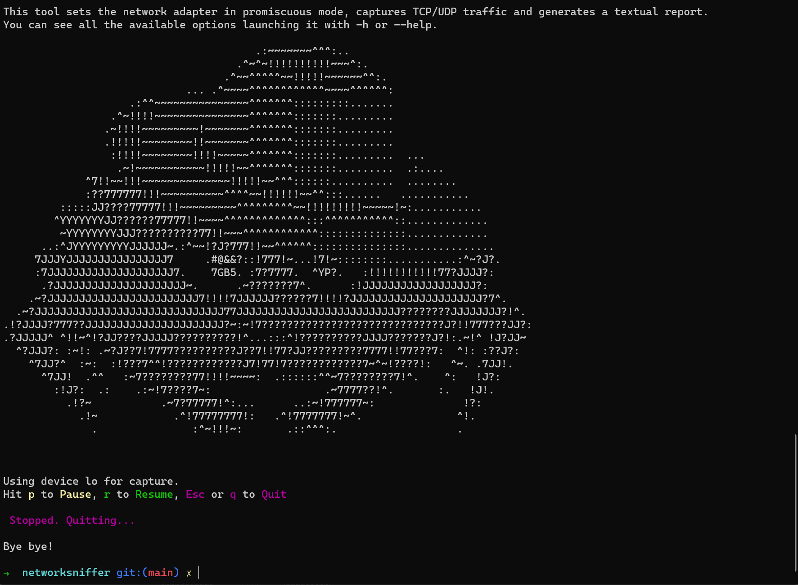

# snifferlib
**snifferlib** is a library that lets you capture TCP/UDP traffic in promiscuous mode and produce a textual report.<br>
## Features
 - [x] choose capture device
 - [x] choose the output file
 - [x] set a filter using [BPF](https://biot.com/capstats/bpf.html) syntax
 - [x] choose how to sort the traffic
 - [x] select a time interval after which an updated version of the report is generated
 - [x] pause, resume and stop the sniffing process at any time

## Report
The report lists, for each of the observed network address/port pairs, the transported protocols, the cumulated number of bytes and packets transmitted, and the timestamp of the first and last occurrence of information exchange.<br>
A table like this one is printed in the output file:
| SRC_IP        | DST_IP       | SRC_PORT | DST_PORT | PROTOCOLS | BYTES | PACKETS # | FIRST TIMESTAMP     | LAST TIMESTAMP      |
|---------------|--------------|----------|----------|-----------|-------|-----------|---------------------|---------------------|
| 52.97.186.114 | 192.168.1.49 | 443      | 52583    | TCP       | 26 KB | 21        | 2022-11-07 22:31:01 | 2022-11-07 22:31:01 |
| 52.98.159.2   | 192.168.1.49 | 443      | 52584    | TCP       | 13 KB | 38        | 2022-11-07 22:31:01 | 2022-11-07 22:31:02 |
|               |              |          |          |           |       |           |                     |                     |

## Documentation
To get a better understanding of how to use this library, have a look at the documentation.<br>
You can generate it from the source code by launching `cargo doc --lib --no-deps`.<br>
This will generate the documentation in `target/doc/snifferlib`.<br><br>


# rsniffer
**rsniffer** is an application that takes full advantage of snifferlib.
The application captures TCP/UDP traffic in promiscuous mode and generates a report to a file of choice.

## Features
 - [x] choose capture device
 - [x] choose the output file
 - [x] set a filter using [BPF](https://biot.com/capstats/bpf.html) syntax
 - [x] choose how to sort the traffic
 - [x] select a time interval after which an updated version of the report is generated
 - [x] pause, resume and stop the sniffing process at any time

The application also takes care of properly indicating any failure of the sniffing process, providing meaningful and actionable feedback.
When the sniffing process is active, a suitable indication is provided to the user.

## Screenshots
<p align="center">
    
</p>
<br>

<p align="center">
    
&nbsp; &nbsp; &nbsp; &nbsp;
    
</p>


## How to run rsniffer
An easy way to run it compiling from source is:<br><br> 
```cargo run --release -- [OPTIONS]```<br><br>
Some examples:<br>
|           example                                              |                   outcome                   |
|----------------------------------------------------------------|---------------------------------------------|
| ```cargo run --release -- --help```                            | shows how to use rsniffer                   |
| ```cargo run --release -- --list```                            | lists available devices for the capture     |
| ```cargo run --release -- -i 2 -s 6G -f "tcp src port 443"```  | - captures traffic using device with ID = 2<br>- sorts it by amount of transmitted Bytes (in descending order)<br>-  keeps only tcp packets with source port 443  |
| ```cargo run --release -- -o report.txt -t 1```                | - writes report to report.txt<br>- sets time interval to 1 sec             |

An alternative is building rsniffer with `cargo build` and then directly launching the executable placed in `target/debug/` .